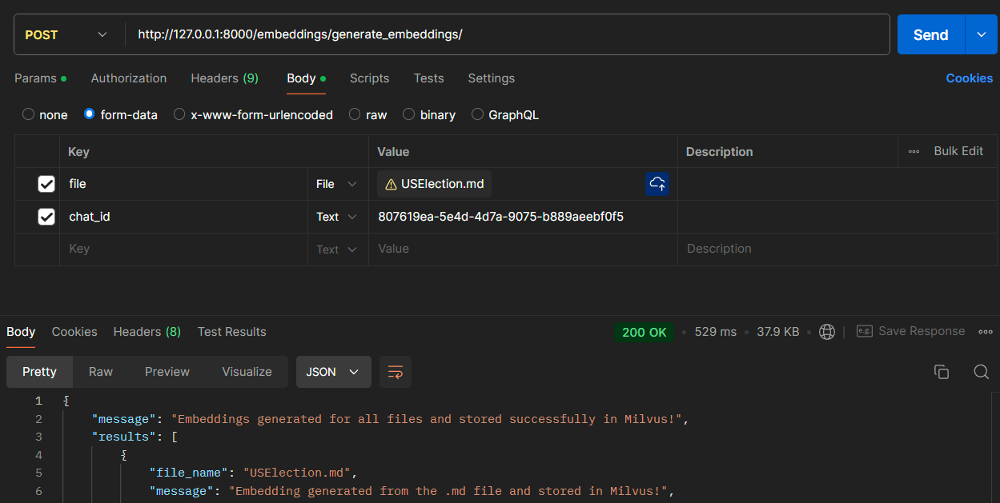
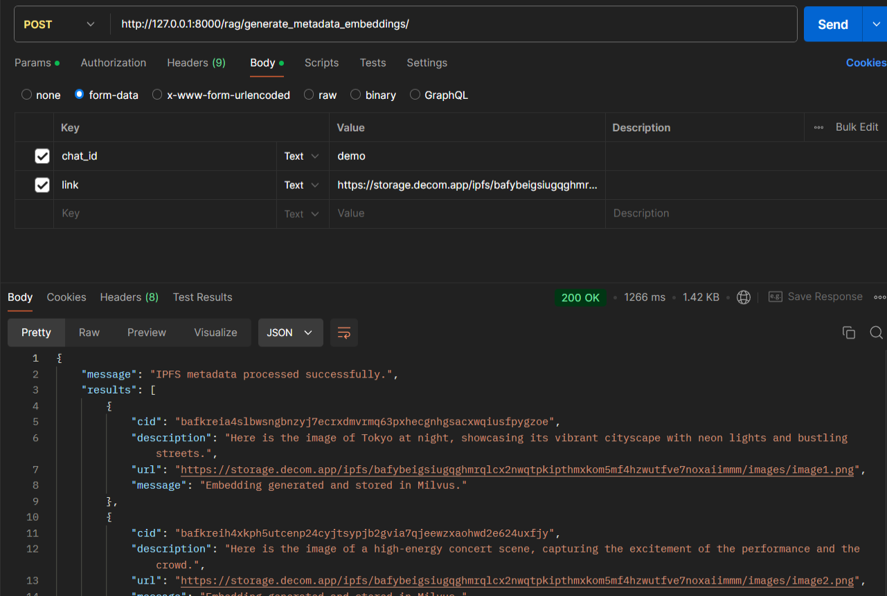

# AI Agent Backend

## Step
1. Make a config/config.js file and put your key on it. (refer to the sample_config.js)
2. ```docker-compose up --build```

## Requests

### 1. Upload files for retrieval

 ```http://127.0.0.1:8000/rag/generate_embeddings/```



### 2. Upload meta data for retrieval

 ```http://127.0.0.1:8000/rag/generate_metadata_embeddings/```

